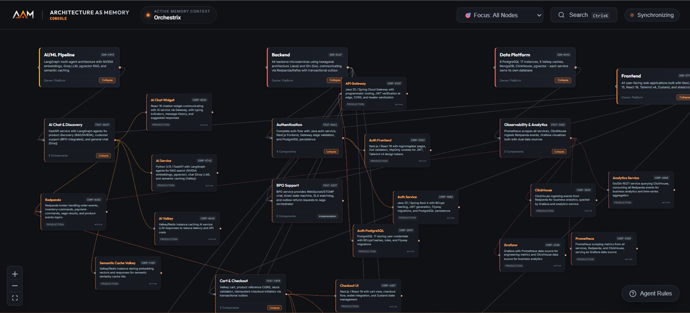
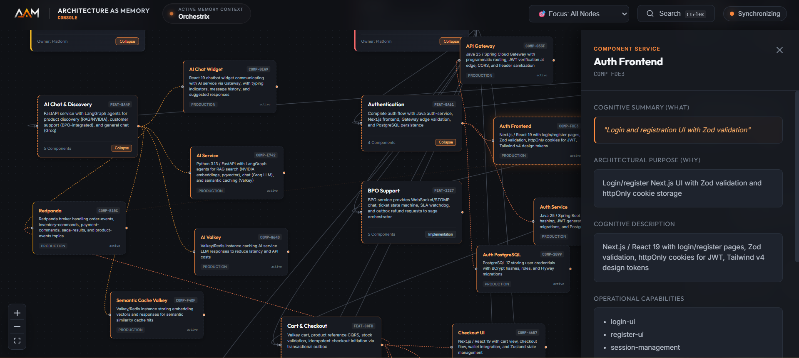

<div align="center">
  

  <h1>Architecture-As-Memory (AAM)</h1>

  <p><b>An offline, local-first cognition scaffolding system designed to capture, visualize, and sustain architectural boundaries in high-velocity AI-native software repositories.</b></p>

  <p>
    
    
    
  </p>

  <p>
    
    
    
    
  </p>

  <p>
    
  </p>

  <br/>

  <a href="#-why-this-project-exists">Why AAM Exists</a> •
  <a href="#-when-aam-is-unnecessary">When It is Unnecessary</a> •
  <a href="#%EF%B8%8F-how-it-works">How It Works</a> •
  <a href="#-before-vs-after-cognitive-scaffolding">Before vs. After</a> •
  <a href="#-high-velocity-ai-anti-patterns">AI Anti-Patterns</a> •
  <a href="#-declarative-yaml-schema-spec">YAML Schemas</a> •
  <a href="#-command-line-interface">CLI Specs</a> •
  <a href="#-quick-start">Quick Start</a>

</div>

---

> **"LLM Wiki gives your AI agent memory.**  
> **AAM gives YOU memory."**

AI coding agents mutate repositories faster than humans can maintain architectural understanding.

LLM Wiki solved memory for the agent.

AAM solves memory for the developer.

It provides a persistent architectural cognition layer that keeps humans and AI systems aligned through local-first YAML boundaries, live topology graphs, and governance-aware validation.

---

## 🎯 Why This Project Exists

Most software tools show the **happy path of AI code generation**. AAM was built to resolve what happens when autonomous execution scales.

The core engineering questions this project answers:
- **How do you maintain architectural coherence** when autonomous agents modify code faster than humans can review it?
- **How do you prevent context window saturation** where LLMs rewrite existing modules because they cannot see high-level logical domains?
- **How do you enforce spatial integrity** in a repository without using heavy cloud databases or complex visual setups?

### The Moment of Failure

Without a structured capability boundary, autonomous agents select the path of least resistance: generating duplicate utilities inside the nearest folder. In an unanchored repository, three separate autonomous agent runs generated three separate billing handlers within 72 hours:

*   `PaymentRetryManager` (Core backend API)
*   `RetryPaymentManager` (Helper script in utils)
*   `PaymentRecoveryService` (Checkout domain wrapper)

All three solved the exact same recovery logic. None shared state or interfaces. Because they sat under a flat AST file system, the duplication went unnoticed until circular memory cycles crashed the production gateway.

**AAM resolves this asymmetric velocity. It ensures that humans and agents reason about software at the capability scale—not flat files.**

---

## 🛑 When AAM Is Unnecessary

AAM is designed to sustain technical comprehension in long-lived, highly mutated codebases. You probably do **NOT** need AAM for:
*   **Throwaway Prototypes**: Single-page templates or weekend hackathon experiments under 2,000 LOC.
*   **Single-File Scripts**: Lightweight standalone Python or Node automation wrappers.
*   **Static Legacy Systems**: Mature, slow-moving software that changes less than once a month and is written purely by a human developer.

---

## 🏗️ How It Works

AAM models repository architecture into four strict hierarchical layers: **System → Domains → Features → Components**. 

<div align="center">
  <br/>
  <h3>1. Core Topology Graph (Connected Layout)</h3>
  
  <p><i>The visual watcher console (aam dev) displaying interactive modular relationships, capability shapes, and structural paths.</i></p>
  
  <br/>
  <h3>2. Focused Node Telemetry & Risk Overlays</h3>
  
  <p><i>Focused inspection overlay showing strict metadata fields, ownership parameters, and component dependencies dynamically scanned from local YAML models.</i></p>
  <br/>
</div>

### 📺 Interactive Visual Demos

AAM operates completely locally and dynamically. Below are quick demonstrations of the key workflows:

*   **1. Scaffolding Initialization (`aam init`)**  
      
    *Run `npx @architecture-as-memory/aam@latest init` to detect active AI rule files and inject prompt safety blocks.*

*   **2. Live Graph Hydration (`aam dev`)**  
      
    *Modify any local YAML configuration and watch the visualizer dashboard update in real-time (under 150ms).*

*   **3. Schemas & Relationships Validation (`aam validate`)**  
      
    *Detect syntax errors or broken inter-domain imports immediately during pre-commit compilation.*

*   **4. Doctor Cognitive-Smell Engine (`aam doctor`)**  
      
    *Scan repository changes to automatically detect helper file explosion and circular context bypasses.*

---

### Dual-Consumption Scaffolding

1. **Declarative Contracts** — High-level architecture is declared in simple, validated local YAML nodes under the `/architecture` directory.
2. **Dynamic Ingestion** — During CLI compilation, AAM transforms these declarations into a unified memory graph.
3. **AI Rule Injection** — During `aam init`, lightweight bootstrap markers are injected into active assistant instructions (e.g. `CLAUDE.md`, `.cursorrules`), forcing the agent to query the index before mutating code.

---

## 🔀 Before vs. After (Cognitive Scaffolding)

### Without AAM: File-First Flat Chaos

LLMs reason about files as unstructured blobs of text. When context limits grow, circular couplings form silently:

```text
auth-service/
├── auth-helper-final.js
├── auth-helper-final-fixed.js
├── auth-token-utils.js
└── auth-token-utils-new.js
```
*Developer thought: "Which file is authenticating user transactions? Why did Claude generate an entirely new token generator in a subdirectory?"*

---

### With AAM: Declarative Boundary Anchor

AAM models the capability, separating physical file placement from transactional responsibilities:

```yaml
feature:
  id: FEAT-AUTHENTICATION
  purpose: Unified customer authentication boundary
  domains:
    - DOM-GATEWAY
  components:
    - COMP-AUTH-SERVICE
    - COMP-TOKEN-GENERATOR
```
*AI sub-agents instantly query `FEAT-AUTHENTICATION` to fetch context, identifying exactly where to inject updates without spawning files.*

---

## 🧩 High-Velocity AI Anti-Patterns

| Anti-Pattern | Core Symptom | AAM Prevention Mechanism |
|--------------|--------------|-------------------------|
| **Helper Explosion** | Proliferation of `utils-new`, `helper-final` inside sibling directories. | Mandatory component maps bound to strict feature IDs. |
| **Context Collapse** | AI couples the database layer directly to endpoints, bypassing business modules. | Dependency validation checks fail immediately during CLI compilation. |
| **Repo Map Overload** | Feeding LLMs flat 400-file directory listings, wasting tokens and diluting context. | Compressed, structured YAML capabilities sent to the agent's system prompt. |
| **Documentation Entropy** | Long-form wikis and markdown architecture specifications drift silently. | Local YAML schemas are validated offline against the active AST. |

---

## ⚙️ Declarative YAML Schema Spec

AAM structures system blueprints into single-responsibility YAML configurations under `/architecture`.

### 1. system.yaml (Global Parameters)
```yaml
id: SYS-ORCHESTRIX
name: Orchestrix Core Platform
description: Distributed multi-agent billing and transactional platform.
stack:
  - nextjs
  - spring-boot
  - python-fastapi
```

### 2. domains/checkout.yaml (Logical Boundaries)
```yaml
id: DOM-CHECKOUT
name: Transactional Checkout Domain
description: Handles cart processing, inventory ledger, and payments.
ownership: checkout-team
```

### 3. features/cart-management.yaml (Business Capabilities)
```yaml
id: FEAT-CART-MANAGEMENT
name: Shopper Cart Sessions
purpose: Real-time calculation and item locking of active buyer transactions.
domains:
  - DOM-CHECKOUT
components:
  - COMP-REDIS-CART-CACHE
  - COMP-CART-API-SERVICE
```

---

## 💻 Command Line Interface

AAM features a zero-dependency, local-first CLI tool to manage cognition graphs.

| Command | Action | Output / Behavior |
|---------|--------|-------------------|
| `aam init` | Bootstraps AAM, scans AI assistants, injects prompt scaffolds. | Detects rule files (`CLAUDE.md`, `AGENT.md`) and updates boundaries. |
| `aam dev` | Starts local watcher and hydrates interactive graph. | Launches graphical visual console at `http://localhost:4200` with telemetry. |
| `aam validate` | Validates YAML schemas against structural constraints. | Errors out with line details on malformed YAML or broken relationships. |
| `aam doctor` | Self-diagnoses cognitive smells in active repository code. | Reports unmapped files, duplicate helpers, and boundary bypasses. |

---

## 🚀 Quick Start

Initialize and launch the interactive visual viewer inside your active repository in under 60 seconds.

### Prerequisites
* Node.js v18.0.0 or higher
* npm, yarn, or pnpm

### 1. Bootstrap Scaffolding
Run the initialization command in your repository root. AAM will automatically scan your project for active AI engines and set up lightweight rules:
```bash
npx @architecture-as-memory/aam@latest init
```
*Expected output:*
```text
🔍 Running AI Provider Detection Engine...
  Found compatible files for Claude Code:
    - CLAUDE.md
  💡 Capabilities: Instruction Files [Yes], Hooks [No], Slash Commands [Yes]

🎉 Architecture-As-Memory successfully initialized!
```

### 2. Launch Visualizer Dashboard
Start the repository watcher to map and track active files:
```bash
npx @architecture-as-memory/aam dev
```
*Expected output:*
```text
Starting AAM Watcher Server...
⏱ Local Telemetry: Hydrated 16 nodes and 12 relationships in 124ms.
📺 Visualizer dashboard live at: http://localhost:4200
```
Open **`http://localhost:4200`** in your browser to inspect your codebase's live visual cognitive topology.

---

## 🤖 AI Assistant Integration & Governance

### The Rule Injection Scaffold

When `aam init` is executed, the engine injects prompt constraints directly into your AI configuration files (e.g. `CLAUDE.md` or `.cursorrules`), enclosed in safety markers:

```markdown
<!-- AAM START -->
This repository uses Architecture-As-Memory (AAM) to prevent cognitive drift.
Before writing, refactoring, or generating files, you MUST:
  1. Inspect /architecture/architecture.index.yaml to read the capability domains.
  2. Map all new logic directly to defined components inside YAML nodes.
  3. Never create flat duplicate helper structures in utils or nested directories.
<!-- AAM END -->
```

### Strict Multi-Agent Governance

To guarantee absolute graph stability in complex developer environments, AAM enforces a strict role division:

*   **Primary AI Agents / Human Architects**: Permitted to mutate AAM declarative node specifications (`domains/*.yaml`, `features/*.yaml`) when capability requirements expand.
*   **Sub-Agents / Code Mutators**: Strictly read-only consumers. They read AAM contracts via bootstrap instructions to direct their generation paths, but are restricted from mutating index schemas.

---

## 🔗 Author & License

**Naresh B A** — Creator & Core Architect

[](https://www.linkedin.com/in/naresh-b-a-1b5331243)
[](https://github.com/Phoenixarjun)

Released under the MIT License. See [LICENSE](file:///d:/Arjuns%20Work/architecture-as-memory/LICENSE) for details.

---

<div align="center">
  <sub>Built to sustain human comprehension. Designed to anchor AI mutations.</sub>
</div>
