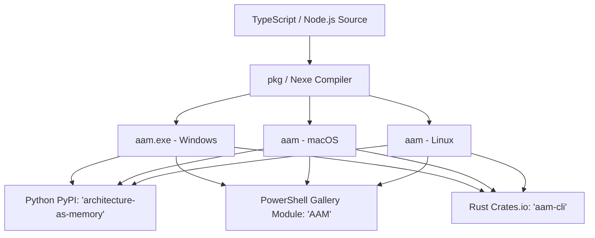

# AAM Cross-Ecosystem Distribution Blueprint

This document details the architectural blueprint for distributing **Architecture-As-Memory (AAM)** to developers operating outside of the Node.js / NPM ecosystem. It establishes how to enable Python, PowerShell, Rust, and systems engineers to run AAM validation, doctor diagnostics, and visualizers without requiring Node.js or `npx` pre-installed.

---

## 1. Distribution Topology Overview

To remain completely language-agnostic while keeping a single main JavaScript/TypeScript source codebase, AAM uses a **compiled core executable binary strategy** wrapped by ecosystem-native package managers:



---

## 2. Compilation Strategy (Zero-Dependency Binaries)

We use Vercel's `pkg` or `nexe` to compile the AAM CLI and its embedded Express visualizer server into **single-file executable binaries** for Windows, macOS, and Linux.

### The Compiling Configuration
Inside `/packages/cli/package.json`, we configure `pkg` targets:
```json
"pkg": {
  "assets": [
    "viewer/dist/**/*",
    "templates/**/*"
  ],
  "targets": [
    "node18-win-x64",
    "node18-macos-x64",
    "node18-linux-x64"
  ]
}
```

This compiles:
1.  **CLI Command Routing**: Parser command flags (`init`, `validate`, `doctor`, `dev`).
2.  **Embedded Watcher Server**: Express API and YAML filesystem watchers.
3.  **Bundled Visualizer App**: Compiled ReactFlow static HTML/JS assets loaded from memory.

---

## 3. Python Package (PyPI) Integration

We can publish `architecture-as-memory` to PyPI to let Python developers run validation inside their virtualenvs.

### Implementation Pattern (Self-Bootstrapping Wheel)
We construct a Python wheel containing a bootstrap script that detects the platform and executes/downloads the matching compiled binary.

#### Module Layout (`setup.py` / `pyproject.toml`):
```text
architecture-as-memory/
├── pyproject.toml
├── src/
│   └── aam/
│       ├── __init__.py
│       ├── __main__.py      # Executed on 'python -m aam'
│       ├── cli.py          # Subprocess runner
│       └── bin/            # Pre-compiled binaries downloaded or packed
```

#### Executable Invoker (`src/aam/cli.py`):
```python
import sys
import os
import subprocess
import platform

def get_binary_path():
    system = platform.system().lower()
    base_dir = os.path.dirname(os.path.abspath(__file__))
    
    if system == "windows":
        return os.path.join(base_dir, "bin", "aam.exe")
    elif system == "darwin":
        return os.path.join(base_dir, "bin", "aam-macos")
    else:
        return os.path.join(base_dir, "bin", "aam-linux")

def run():
    bin_path = get_binary_path()
    # Pass all system CLI arguments directly to the compiled executable
    result = subprocess.run([bin_path] + sys.argv[1:])
    sys.exit(result.returncode)
```

Python developers simply execute:
```bash
pip install architecture-as-memory
aam validate
```

---

## 4. PowerShell Module (PowerShell Gallery)

For Windows systems administrators and PowerShell developers, we can package AAM as a native module published to the **PowerShell Gallery**.

### Native Cmdlet Wrapper Module
Instead of a simple alias, we create native cmdlet mappings, allowing pipeline support and autocomplete.

#### Module Manifest (`AAM.psd1`):
```powershell
@{
    ModuleVersion = '1.0.0'
    GUID          = 'a5f27c3e-f1b2-4d56-bc92-3a8309a473ee'
    Author        = 'Naresh B A'
    CmdletsToExport = @('Initialize-AAM', 'Test-AAM', 'Start-AAMViewer')
}
```

#### Module Script (`AAM.psm1`):
```powershell
$BinPath = Join-Path $PSScriptRoot "bin/aam.exe"

function Initialize-AAM {
    [CmdletBinding()]
    param()
    & $BinPath init
}

function Test-AAM {
    [CmdletBinding()]
    param(
        [Parameter(Mandatory=$false)]
        [Switch]$Doctor
    )
    if ($Doctor) {
        & $BinPath doctor
    } else {
        & $BinPath validate
    }
}

function Start-AAMViewer {
    [CmdletBinding()]
    param(
        [Parameter(Mandatory=$false)]
        [int]$Port = 4200
    )
    & $BinPath dev --port $Port
}
```

PowerShell developers install and execute it natively:
```powershell
Install-Module -Name AAM -Scope CurrentUser
Initialize-AAM
Test-AAM -Doctor
```

---

## 5. Rust Crate (crates.io)

For Rust developers, we can package a binary crate `aam-cli`.

### Rust Binary Wrapper Crate
The Rust crate bundles or dynamically pulls the compiled platform binary or wraps the runtime in a lightweight Rust wrapper.

#### Crate `src/main.rs`:
```rust
use std::env;
use std::process::{Command, exit};
use std::path::PathBuf;

fn main() {
    let args: Vec<String> = env::args().skip(1).collect();
    
    // Locate the embedded binary target
    let exe_path = get_embedded_binary_path();
    
    let status = Command::new(exe_path)
        .args(&args)
        .status()
        .expect("Failed to execute AAM core binary");
        
    exit(status.code().unwrap_or(1));
}
```

Rust developers execute:
```bash
cargo install aam-cli
aam validate
```
